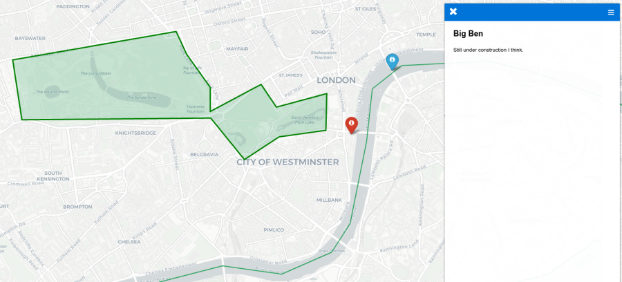

# TODO

* [ ] make this into a sailing map

Links
* [leaflet_polys](https://docs.google.com/spreadsheets/d/1Tq5FKZm-OgYg-XRRsoad4160o4YPqU0Srn0iQdufKrQ/edit#gid=0)
* [leaflet_points](https://docs.google.com/spreadsheets/d/1y-L6NoijJRmypJ_-Bkrb0EqQm_qcVnCtuLuszOVMD3M/edit#gid=0)
* [Trip Drawer](https://www.gpsvisualizer.com/draw/)


# leaflet-gsheets

### Note for people who've forked this in the past ⚠️
This previously used [Tabletop.js](https://github.com/jsoma/tabletop) but apparently it will stop working in September 2020 (thanks Google), so I've switched this repo over to [PapaParse](https://github.com/mholt/PapaParse). Anyone using the old code should try to switch over!

### For new people, nothing to worry about! 👍
How to create a simple [Leaflet](https://leafletjs.com/) web map that automatically pulls data from two simple Google Sheets tables. Sidebar created using [leaflet-sidebar-v2](https://github.com/nickpeihl/leaflet-sidebar-v2), and Google Sheets connection with [PapaParse](https://github.com/mholt/PapaParse).

The resultant map can be seen here: [https://rdrn.me/leaflet-gsheets/](https://rdrn.me/leaflet-gsheets/)

I explained the process in more length in my blog post here: [Leaflet maps with data from Google Sheets](https://rdrn.me/leaflet-maps-google-sheets/).



## Steps
1. Open the following two Google Sheets and copy them to your account (top left, "Add to My Drive")
    - [leaflet_geoms](https://docs.google.com/spreadsheets/d/1EUFSaqi30b6oefK0YWWNDDOzwmCTTXlXkFHAc2QrUxM/edit?usp=sharing)
    - [leaflet_points](https://docs.google.com/spreadsheets/d/1kjJVPF0LyaiaDYF8z_x23UulGciGtBALQ1a1pK0coRM/edit?usp=sharing)
2. In each one, do the following three steps:
   - In Google Sheets, go to File -> Publish to the Web -> Publish
   - Choose "Comma-separated values (.csv)" in the dropdown on the right
   - Then copy the link provided just underneath, and save it somewhere
3. Back in GitHub, Fork this repo (top right of this page)
4. Either clone/download your new repo to your machine, or use GitHub's built-in code editor, and open [main.js](main.js)
5. At line 7 where it says "PASTE YOUR URLs HERE", paste the URLs you copied above
6. If you want to display your new website using [GitHub Pages](https://pages.github.com/):
    - Go to the GitHub page for your repository
    - Click Settings -> go down to GitHub Pages -> under Source choose master branch
    - It may take a while, but the site should become available at `your-username.github.io/leaflet-gsheets`
7. Customise the Google Sheets with the data you want
8. Customise the JavaScript however you want, there are comments to show where to comment/uncomment code to enable/disable features.

## Adding geometry data
In [leaflet_points](https://docs.google.com/spreadsheets/d/1kjJVPF0LyaiaDYF8z_x23UulGciGtBALQ1a1pK0coRM/edit?usp=sharing) you can add latitude/longitude pairs for points.

In the [leaflet_geoms](https://docs.google.com/spreadsheets/d/1EUFSaqi30b6oefK0YWWNDDOzwmCTTXlXkFHAc2QrUxM/edit?usp=sharing) sheet, you can add **points**, **lines**, **polygons** or multi-version of these, as [GeoJSON](https://geojson.io/) representations. This can be the full contents of a `.geojson` file, or really any part of a GeoJSON that ultimately contains a geometry with coordinates.

A good website to use to make these geometries is [geojson.io](http://geojson.io) and a good place to find and download geometries for standard things (continents, countries and whatnot) is [geojson.xyz](http://geojson.xyz/).

Some examples. Note that these exclude the "FeatureCollection", "Feature" etc boilerplate, but you can include these and it will work just the same.

```
// A Point
{
    "type": "Point",
    "coordinates": [18, 36]
}

// A LinteString (a line)
{
    "type": "LineString",
    "coordinates": [
        [1, 42],
        [5, 17],
        [6, 28]
    ]
}

// A Polygon (this one happens to be a square)
{
    "type": "Polygon",
    "coordinates": [[
        [0, 40],
        [3, 40],
        [3, 42],
        [0, 42],
        [0, 40]
      ]]
}
```

## Parting notes

Get in touch if you need a hand!


## UK GEOJSON API
* https://geoportal.statistics.gov.uk/datasets/regions-december-2019-boundaries-en-buc/geoservice
* https://ons-inspire.esriuk.com/arcgis/rest/services/Administrative_Boundaries/Regions_December_2019_Boundaries_EN_BUC/MapServer/0/query?where=1%3D1&outFields=objectid,long,lat,rgn19nm&outSR=4326&f=json
